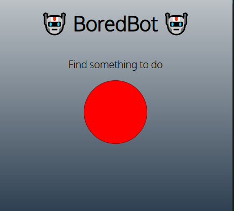
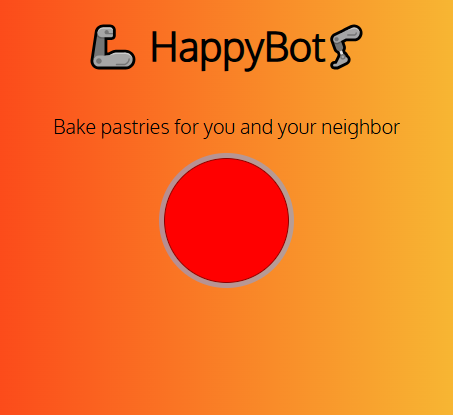

# 🤖 BoredBot 🤖

A simple JavaScript project that helps users find random activities when they are bored.  
The app fetches suggestions from an external API and dynamically updates the webpage using JavaScript.

## 🛠️ Technologies Used

- HTML5
- CSS3
- JavaScript (ES6)
- Fetch API
- REST API
- DOM Manipulation

## 🌐 API Used

This project uses the Bored API:

```
https://apis.scrimba.com/bored/api/activity
```
## 📸 Preview


