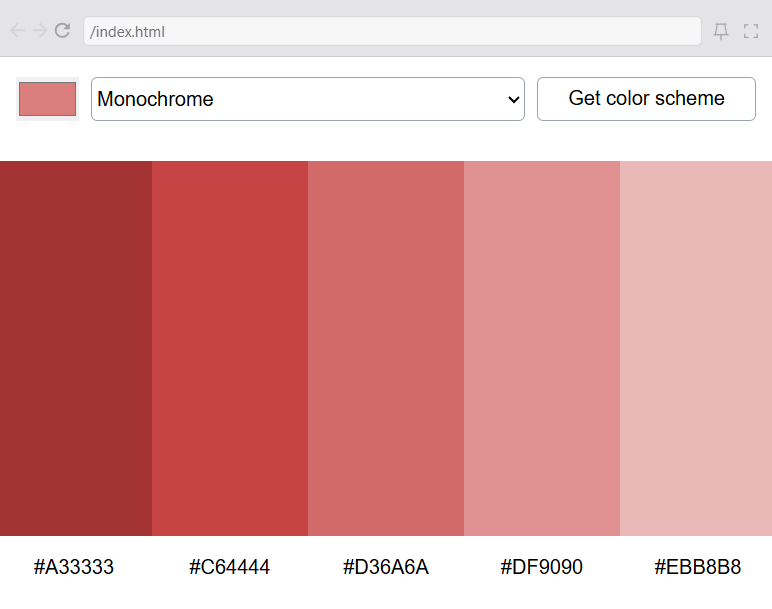
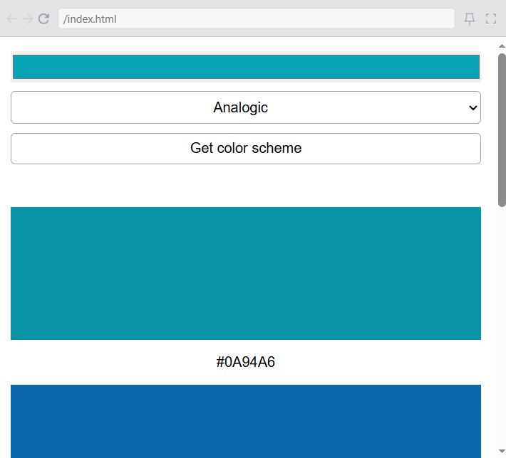

# 🎨 Color Scheme Generator

A responsive color palette generator built with **HTML, CSS, and JavaScript**.  
Users can choose a seed color, select a color harmony mode, and generate a beautiful color scheme using the **The Color API**.

## ✨ Features

- 🎨 Select a custom seed color using a color picker
- 🌈 Generate color schemes based on different color relationships
- 📋 Display generated colors with their HEX values
- 📱 Fully responsive design for desktop and mobile devices
- ⚡ Uses Fetch API to retrieve dynamic color palettes

## API
API Documentation:
https://www.thecolorapi.com/docs

---

## 🔮 Future Improvements

Possible improvements:

- Add a copy-to-clipboard button for HEX values
- Add loading animations while fetching colors
- Save favorite color palettes
- Add dark/light theme support
- Allow exporting palettes as images

---

## 📸 Preview

Desktop version

Mobile version

