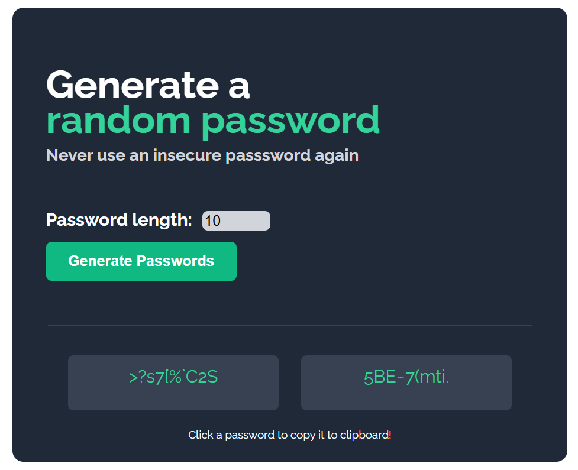

# Password Generator 🔐

A simple and responsive password generator built with HTML, CSS, and JavaScript.

Users can generate secure random passwords, choose the password length, and copy passwords directly to the clipboard.

---

## Features
- Generate two random passwords
- Choose custom password length
- Copy password to clipboard with one click
- Random uppercase and lowercase letters
- Numbers and special characters included
- Responsive and clean UI

---

## JavaScript Concepts Used
- Arrays
- Functions
- Loops
- Conditional logic
- DOM manipulation
- Random number generation
- Clipboard API
- onclick events

- # UI

