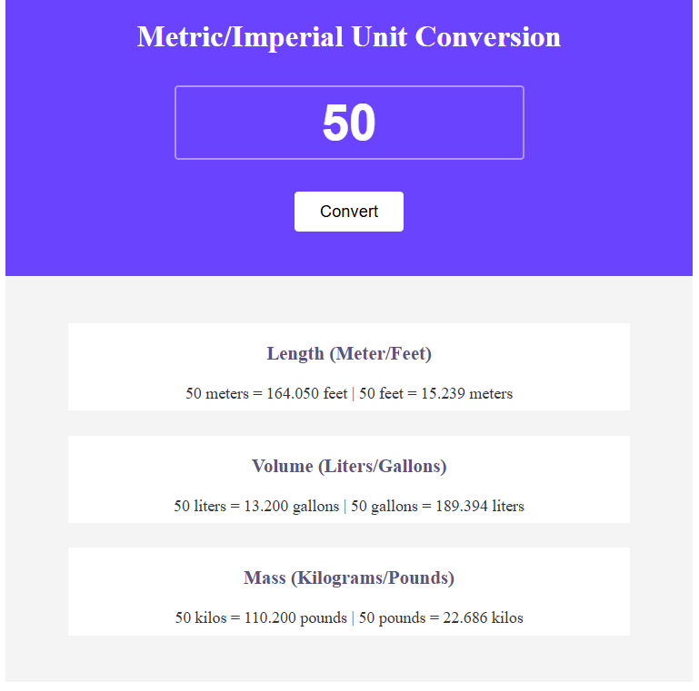

# Metric / Imperial Unit Converter

A simple web-based unit converter built with **HTML, CSS, and JavaScript**.  
This project converts between metric and imperial units for length, volume, and mass in real time.

---

## 🚀 Features

- Convert **meters ⇄ feet**
- Convert **liters ⇄ gallons**
- Convert **kilograms ⇄ pounds**
- Instant conversion on button click
- Clean and minimal UI

---

## 🧠 How It Works

The user enters a numeric value, and the app converts it into different unit systems using JavaScript calculations.

### Conversion formulas used:

- 1 meter = 3.281 feet  
- 1 liter = 0.264 gallons  
- 1 kilogram = 2.204 pounds  

Each value is displayed in both directions (e.g., meters → feet and feet → meters).

## 📸 Preview

