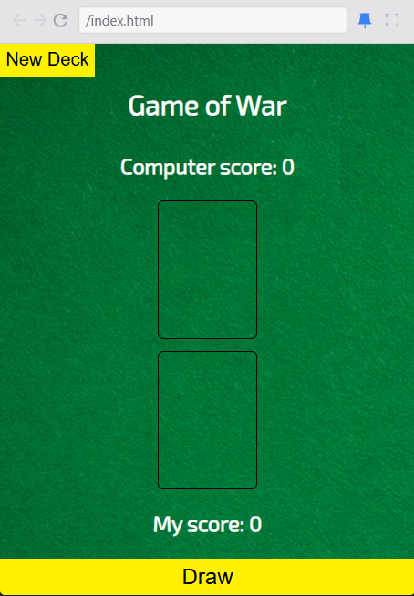
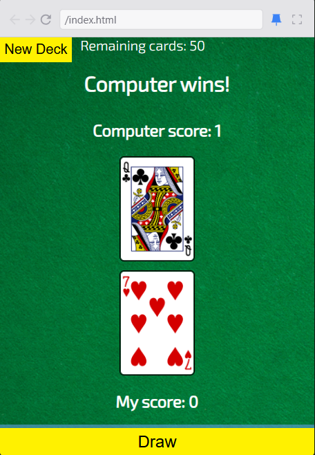
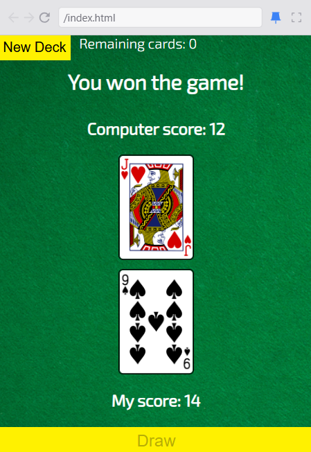

# 🃏 Game of War

A simple browser-based implementation of the classic **War** card game built with **HTML**, **CSS**, and **JavaScript**. The game uses the Deck of Cards API to create and shuffle a deck, draw cards, compare their values, and keep score until all cards have been played.

---

## Features

- 🎴 Create a brand new shuffled deck
- 🂠 Draw two cards at a time
- 🤖 Computer vs Player
- 🏆 Automatic winner detection
- 📊 Live score tracking
- 📦 Remaining card counter
- 🚫 Draw button disables when the deck is empty
- 🎉 Final game winner announcement

---
## API Used

### Deck of Cards API

This project uses the Scrimba proxy for the Deck of Cards API.

Create a shuffled deck:

```
GET /deck/new/shuffle/
```

Draw cards:

```
GET /deck/{deck_id}/draw/?count=2
```

Documentation:

https://deckofcardsapi.com/

---
## Future Improvements

- Restart game without refreshing the page
- Add animations when cards are drawn
- Display suit and card value alongside images
- Track total wins across multiple games
- Add sound effects
- Improve responsive layout for mobile devices
- Add card flip animation
- Add loading state while fetching cards

---
## UI Preview

### 1. New Deck



### 2. During Gameplay



### 3. Game Over


